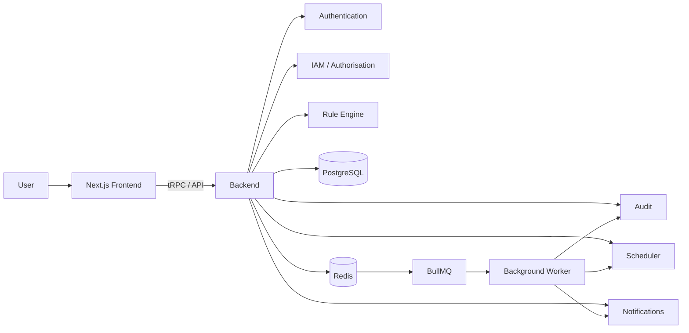
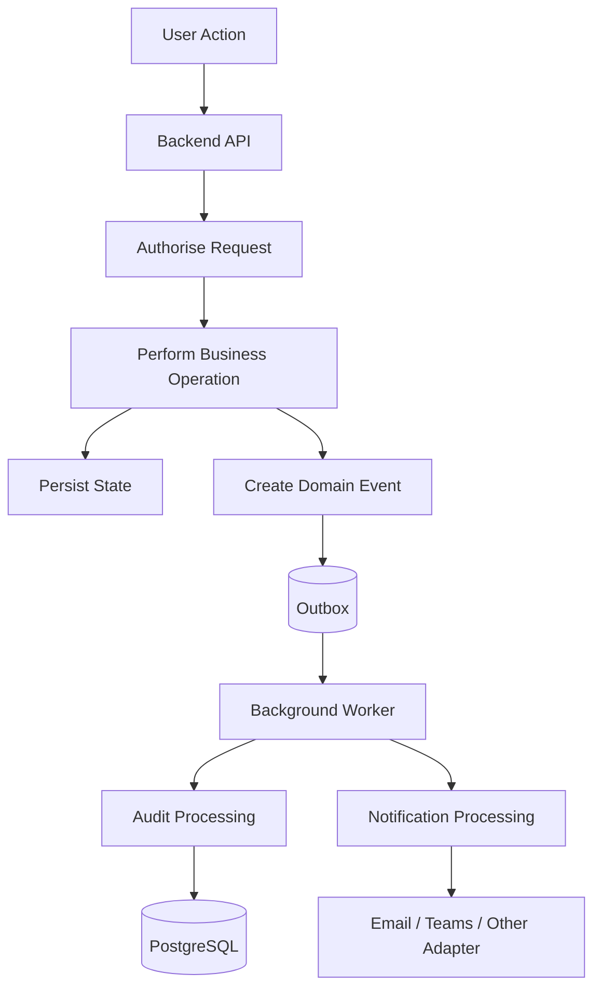

# StratAlign

**StratAlign** is a full-stack strategy execution and governance platform designed to help organisations translate strategic objectives into structured plans, measurable performance indicators, approval workflows, rule-driven evaluations, and auditable operational actions.

The platform is being developed as a TypeScript monorepo with a **Next.js frontend**, **Node.js backend services**, **PostgreSQL**, **Redis**, **BullMQ**, and shared domain packages. Its architecture is designed around secure identity and access management, deterministic business rules, traceable audit records, background processing, and reliable notification workflows.

> **Project status:** Active development. Some modules described below represent the target architecture and may still be under implementation.

---

## Contents

* [Overview](#overview)
* [Project Goals](#project-goals)
* [Core Capabilities](#core-capabilities)
* [System Architecture](#system-architecture)
* [Application Workflow](#application-workflow)
* [Technology Stack](#technology-stack)
* [Repository Structure](#repository-structure)
* [Core Modules](#core-modules)
* [Security and Access Control](#security-and-access-control)
* [Rule Engine](#rule-engine)
* [Audit Architecture](#audit-architecture)
* [Background Jobs and Notifications](#background-jobs-and-notifications)
* [Testing Strategy](#testing-strategy)
* [Getting Started](#getting-started)
* [Development Commands](#development-commands)
* [Environment Configuration](#environment-configuration)
* [Development Principles](#development-principles)
* [Project Scope](#project-scope)

---

## Overview

Strategic planning systems often contain objectives, KPIs, scorecards, approvals, business rules, and governance processes that are distributed across spreadsheets, documents, email, and disconnected applications.

StratAlign aims to bring these processes into a single platform where organisations can:

* model strategic hierarchies;
* manage balanced scorecards;
* evaluate business rules consistently;
* route actions through approval workflows;
* enforce role-based access control;
* maintain a reliable audit history;
* schedule recurring operations;
* generate notifications from domain events; and
* support scalable background processing without coupling long-running work to user-facing requests.

The project follows a modular architecture so that security, rules, audit, scheduling, and domain logic can evolve independently while sharing strongly typed interfaces.

---

## Project Goals

StratAlign is designed around five primary engineering goals:

1. **Strong governance**
   Important operations should be authorised, traceable, and reproducible.

2. **Deterministic business logic**
   Strategic calculations and rule evaluations should be implemented as testable, side-effect-free domain logic wherever possible.

3. **Reliable asynchronous processing**
   Audit processing, scheduled work, and notifications should not depend on a browser request remaining open.

4. **Shared type safety**
   Frontend, backend, validation, and domain packages should share TypeScript contracts instead of duplicating data definitions.

5. **Scalable monorepo development**
   Applications and reusable packages are maintained in a pnpm/Turborepo workspace with shared tooling and isolated responsibilities.

---

## Core Capabilities

The target platform includes the following functional areas:

### Strategy Management

* Strategy hierarchy management
* Organisational goals and objectives
* Parent/child strategic relationships
* Structured strategy views

### Balanced Scorecards

* Scorecard management
* KPI and measure representation
* Performance aggregation
* RAG status calculations
* Variance and threshold evaluation

### Approvals

* Approval queues
* Individual approval views
* Role-aware approval actions
* Step-up authentication for sensitive operations where required

### Identity and Access Management

* User authentication
* Session management
* OIDC identity support
* Role-based authorisation
* Permission checks
* Authentication freshness controls
* Login rate limiting

### Rule Engine

* Threshold rules
* Roll-up calculations
* Variance alerts
* RAG aggregation
* Gate criteria
* Reusable rule evaluation

### Audit

* Domain-event journaling
* Audit snapshots
* Traceable changes to sensitive operations
* Role-grant audit coverage

### Scheduling and Notifications

* Scheduled jobs
* Redis-backed queues
* BullMQ workers
* Notification delivery workflows
* Extensible delivery channels such as email or Microsoft Teams

---

## System Architecture



At a high level, the frontend is responsible for the user experience while the backend owns business operations, authentication, authorisation, rule execution, audit behaviour, scheduling, and notification orchestration.

PostgreSQL provides durable application storage. Redis and BullMQ provide asynchronous job processing for operations that should not execute directly inside request/response flows.

---

## Application Workflow

A typical state-changing operation follows an event-driven workflow:



This approach separates the immediate business transaction from secondary processing such as notifications and audit projection work.

The outbox pattern is intended to reduce the risk of losing important domain events when an application operation succeeds but an external or asynchronous action temporarily fails.

---

## Technology Stack

| Area                         | Technology                                      |
| ---------------------------- | ----------------------------------------------- |
| Monorepo                     | pnpm workspaces, Turborepo                      |
| Language                     | TypeScript                                      |
| Frontend                     | Next.js, React                                  |
| Backend                      | Node.js / TypeScript                            |
| API Layer                    | tRPC and application API routes                 |
| Authentication               | Auth.js / OIDC-oriented authentication services |
| Database                     | PostgreSQL                                      |
| ORM                          | Prisma                                          |
| Cache / Queue Infrastructure | Redis                                           |
| Background Jobs              | BullMQ                                          |
| Validation                   | Shared validation package                       |
| Unit / Integration Testing   | Vitest and project test suites                  |
| Browser E2E Testing          | Playwright                                      |
| Integration Infrastructure   | Testcontainers                                  |
| Code Quality                 | ESLint, shared TypeScript configuration         |
| Containerised Local Services | Docker Compose                                  |

---

## Repository Structure

StratAlign is organised as a monorepo containing deployable applications and reusable packages.

```text
StratAlign/
│
├── apps/
│   ├── frontend/
│   │   ├── src/
│   │   │   ├── app/
│   │   │   │   ├── (app)/
│   │   │   │   │   ├── admin/
│   │   │   │   │   ├── approvals/
│   │   │   │   │   │   ├── page.tsx
│   │   │   │   │   │   └── [id]/page.tsx
│   │   │   │   │   ├── audit/
│   │   │   │   │   ├── balanced-scorecards/
│   │   │   │   │   ├── dashboard/
│   │   │   │   │   └── strategy-hierarchy/
│   │   │   │   ├── login/
│   │   │   │   ├── register/
│   │   │   │   └── api/
│   │   │   │       ├── auth/
│   │   │   │       │   ├── [...nextauth]/
│   │   │   │       │   ├── oidc-logout/
│   │   │   │       │   └── oidc-step-up/
│   │   │   │       ├── mock-idp/
│   │   │   │       └── trpc/
│   │   │   ├── components/
│   │   │   │   └── approvals/
│   │   │   ├── lib/
│   │   │   │   ├── auth/
│   │   │   │   └── i18n/
│   │   │   ├── server/
│   │   │   │   ├── routers/
│   │   │   │   │   └── audit.ts
│   │   │   │   ├── backend-iam-client.ts
│   │   │   │   ├── mock-db.ts
│   │   │   │   └── trpc.ts
│   │   │   └── services/
│   │   │       └── iam.service.ts
│   │   ├── e2e/
│   │   │   ├── login.spec.ts
│   │   │   ├── admin.spec.ts
│   │   │   ├── audit.spec.ts
│   │   │   ├── approvals.spec.ts
│   │   │   ├── auth-global-setup.ts
│   │   │   └── utils.ts
│   │   ├── test/
│   │   ├── package.json
│   │   └── .env.example
│   │
│   └── backend/
│       ├── src/
│       │   ├── auth/
│       │   │   ├── credential.service.ts
│       │   │   ├── password.service.ts
│       │   │   ├── session.service.ts
│       │   │   ├── oidc-identity.service.ts
│       │   │   ├── oidc-token-validation.service.ts
│       │   │   ├── authentication-freshness.service.ts
│       │   │   └── login-rate-limiter.service.ts
│       │   ├── iam/
│       │   │   └── iam-authorization.service.ts
│       │   ├── modules/
│       │   │   └── audit/
│       │   │       ├── journal.service.ts
│       │   │       └── snapshot.service.ts
│       │   ├── queue/
│       │   │   ├── worker.factory.ts
│       │   │   └── ...
│       │   ├── database/
│       │   │   └── prisma.service.ts
│       │   ├── worker.ts
│       │   └── main.ts
│       ├── prisma/
│       │   ├── schema.prisma
│       │   └── migrations/
│       │       ├── authentication/
│       │       ├── iam/
│       │       ├── rules/
│       │       ├── audit/
│       │       └── scheduling/
│       ├── test/
│       │   ├── unit/
│       │   ├── integration/
│       │   │   ├── auth.testcontainers.spec.ts
│       │   │   ├── iam.testcontainers.spec.ts
│       │   │   ├── rules.testcontainers.spec.ts
│       │   │   ├── audit-journal.testcontainers.spec.ts
│       │   │   ├── audit-snapshot.testcontainers.spec.ts
│       │   │   ├── audit-role-grant.e2e.testcontainers.spec.ts
│       │   │   ├── notification-delivery.spec.ts
│       │   │   └── queue.spec.ts
│       │   └── e2e/
│       │       └── schedule-to-delivery.spec.ts
│       ├── package.json
│       └── .env.example
│
├── packages/
│   ├── api/
│   │   └── src/
│   │       └── index.ts
│   ├── domain-iam/
│   │   ├── src/
│   │   └── test/
│   ├── rules/
│   │   ├── src/
│   │   └── test/
│   │       ├── gate-criteria.test.ts
│   │       ├── variance-alert.test.ts
│   │       ├── rag-aggregation.test.ts
│   │       ├── rollup.test.ts
│   │       └── evaluate-rule.test.ts
│   ├── shared-types/
│   ├── validation/
│   ├── ui/
│   ├── eslint-config/
│   └── typescript-config/
│
├── docker-compose.yml
├── pnpm-workspace.yaml
├── turbo.json
├── package.json
└── pnpm-lock.yaml
```

### Applications

#### `apps/frontend`

The Next.js application contains the user-facing experience, including:

* authentication screens;
* administrative interfaces;
* approval workflows;
* audit views;
* balanced scorecards;
* dashboard views;
* strategy hierarchy pages;
* frontend tRPC integration; and
* Playwright end-to-end tests.

#### `apps/backend`

The backend owns security-sensitive and domain-oriented server functionality, including:

* credential and password services;
* session handling;
* OIDC identity and token validation;
* authentication freshness checks;
* login rate limiting;
* IAM authorisation;
* audit services;
* queue workers;
* Prisma database access;
* scheduled processing; and
* notification workflows.

### Shared Packages

#### `packages/api`

Shared API-facing contracts and exports.

#### `packages/domain-iam`

Reusable IAM domain logic separated from infrastructure concerns.

#### `packages/rules`

Pure, reusable business-rule evaluation logic.

#### `packages/shared-types`

TypeScript types shared across applications and packages.

#### `packages/validation`

Shared validation schemas used to keep runtime validation consistent across system boundaries.

#### `packages/ui`

Reusable frontend UI components.

#### `packages/eslint-config`

Shared linting rules for the monorepo.

#### `packages/typescript-config`

Shared TypeScript compiler configuration.

---

## Core Modules

### Authentication

Authentication responsibilities are divided into focused backend services rather than a single monolithic authentication module.

Key concerns include:

* credential verification;
* password handling;
* session lifecycle management;
* OIDC identity mapping;
* OIDC token validation;
* authentication freshness; and
* login rate limiting.

The frontend contains the authentication entry points and API routes required for Auth.js/OIDC flows.

### IAM / Authorisation

Authentication determines **who the user is**. IAM determines **what that user is allowed to do**.

StratAlign keeps authorisation logic explicit so that sensitive actions can be protected consistently at the API/domain boundary rather than relying only on UI visibility.

### Rules

The rule engine is maintained as a dedicated shared package so business logic can be:

* deterministic;
* independently testable;
* reusable across modules;
* free from database or network I/O where practical; and
* evaluated consistently by different parts of the platform.

### Audit

The audit subsystem is intended to capture meaningful domain activity rather than only raw application logs.

Journal and snapshot services provide the foundation for reconstructing important state changes and supporting governance requirements.

### Scheduler

Scheduled operations are separated from interactive frontend requests. Jobs can be placed onto queues and processed by workers when appropriate.

### Notifications

Notifications are driven by application/domain events and processed asynchronously. Delivery mechanisms are designed to be replaceable so the application can support channels such as email or Microsoft Teams without coupling business logic directly to a provider.

---

## Security and Access Control

Security is treated as a backend responsibility.

The architecture includes:

* secure password-handling services;
* session management;
* OIDC identity support;
* token validation;
* authentication freshness checks;
* role/permission-based authorisation;
* rate limiting for login flows;
* server-side enforcement of protected operations; and
* audit coverage for security-sensitive changes.

Frontend route protection improves user experience, but it is not treated as a substitute for backend authorisation.

Sensitive operations may also require step-up authentication when a previously authenticated session is no longer considered sufficiently fresh.

---

## Rule Engine

The rule engine supports strategic performance and governance calculations.

Current test areas include:

* **Gate criteria** — determine whether required conditions are satisfied.
* **Variance alerts** — identify meaningful deviation from targets or expected values.
* **RAG aggregation** — calculate Red/Amber/Green states from lower-level performance.
* **Roll-ups** — aggregate values through strategic hierarchies.
* **Rule evaluation** — provide a common execution path for supported rule types.

A key design requirement is that evaluators remain pure wherever possible:

```text
Input data + Rule configuration
              │
              ▼
        Rule evaluator
              │
              ▼
      Deterministic result
```

This makes rule behaviour easier to reason about, test, and reuse.

---

## Audit Architecture

Operational logs and audit records solve different problems.

Application logs help developers understand system behaviour. Audit records provide business-level evidence of important actions.

StratAlign therefore treats audit as a first-class domain concern.

Examples of auditable operations may include:

* role grants or permission changes;
* approval decisions;
* changes to strategic data;
* rule publication;
* sensitive administrative actions; and
* scheduled or automated actions that change business state.

Audit processing can be integrated with the domain-event/outbox workflow so that user-facing transactions remain reliable while secondary audit work is processed consistently.

---

## Background Jobs and Notifications

Redis and BullMQ support asynchronous processing.

Typical use cases include:

* scheduled strategy evaluations;
* notification delivery;
* retryable external integrations;
* audit projection work;
* recurring system tasks; and
* processing that should not block an HTTP request.

The worker process is separated from the main API process:

```text
Backend API
    │
    ▼
 Redis / BullMQ
    │
    ▼
 Background Worker
    │
    ├── Audit jobs
    ├── Notification jobs
    └── Scheduled jobs
```

This separation improves resilience and allows worker capacity to scale independently from the web application.

---

## Testing Strategy

StratAlign uses multiple testing layers because different failures require different kinds of confidence.

### Unit Tests

Used for isolated domain logic such as rule evaluation and service behaviour.

Examples include:

* gate criteria;
* variance alerts;
* RAG aggregation;
* roll-ups; and
* generic rule evaluation.

### Integration Tests

Testcontainers-based integration tests validate behaviour against real infrastructure where appropriate.

Coverage includes areas such as:

* authentication;
* IAM;
* rules;
* audit journal behaviour;
* audit snapshots;
* role-grant audit behaviour;
* queues; and
* notification delivery.

### End-to-End Tests

End-to-end tests verify complete user or system workflows.

Frontend Playwright scenarios include:

* login;
* administration;
* audit;
* approvals; and
* authentication setup.

Backend/system E2E coverage includes the scheduled-job-to-notification-delivery flow.

---

## Getting Started

### Prerequisites

Install the following before running the project locally:

* **Node.js**
* **pnpm**
* **Docker**
* **Docker Compose**

### 1. Clone the repository

```bash
git clone <repository-url>
cd StratAlign
```

### 2. Install dependencies

```bash
pnpm install
```

### 3. Configure environment files

Create local environment files from the provided examples:

```bash
cp apps/frontend/.env.example apps/frontend/.env
cp apps/backend/.env.example apps/backend/.env
```

On Windows PowerShell:

```powershell
Copy-Item apps/frontend/.env.example apps/frontend/.env
Copy-Item apps/backend/.env.example apps/backend/.env
```

Populate the required values for your local environment.

> Do not commit `.env` files or secrets to source control.

### 4. Start local infrastructure

```bash
docker compose up -d
```

This is expected to provide the local infrastructure required by the application, such as PostgreSQL and Redis, according to `docker-compose.yml`.

### 5. Prepare the database

Apply the Prisma migrations using the backend workspace's configured Prisma command.

For example:

```bash
pnpm --filter <backend-package-name> prisma migrate dev
```

Use the exact backend package name and script defined in `apps/backend/package.json`.

### 6. Start development

```bash
pnpm dev
```

Turborepo will run the configured development tasks for the workspace.

---

## Development Commands

The root workspace is intended to expose common monorepo tasks through Turborepo.

```bash
pnpm dev
pnpm build
pnpm test
pnpm lint
```

Individual applications or packages can also be targeted using pnpm filters:

```bash
pnpm --filter <package-name> <script>
```

Always refer to the relevant `package.json` for package-specific commands.

---

## Environment Configuration

Environment templates are stored with each deployable application:

```text
apps/frontend/.env.example
apps/backend/.env.example
```

Use these files as the source of truth for required environment variables.

Common configuration categories may include:

* database connection settings;
* Redis connection settings;
* authentication secrets;
* OIDC provider configuration;
* application URLs;
* queue configuration; and
* notification provider settings.

Environment files containing secrets must remain outside version control.

---

## Development Principles

### Keep domain logic independent

Business rules should not depend directly on React components, HTTP handlers, databases, or external providers unless infrastructure access is genuinely part of that responsibility.

### Authorise on the server

UI restrictions are useful for usability, but all protected operations must be enforced at the backend boundary.

### Prefer explicit contracts

Shared types and validation schemas should define communication between modules instead of relying on undocumented object shapes.

### Separate synchronous and asynchronous work

The API should complete the core business transaction first. Retryable or secondary tasks should be delegated to queues and workers where appropriate.

### Make important actions auditable

Security-sensitive and governance-relevant state changes should produce meaningful audit information.

### Test at the correct boundary

Pure calculations belong in unit tests. Database and infrastructure behaviour belongs in integration tests. Critical user journeys belong in end-to-end tests.

---

## Project Scope

StratAlign is currently focused on an **English-language user experience**. Arabic-language support is not part of the current project requirements.

The architecture remains modular enough for future product changes, but localisation should not be assumed to be an active delivery requirement unless it is reintroduced into the project scope.

---

## Summary

StratAlign combines strategy management with the engineering controls required for a governance-oriented enterprise application:

* a modern Next.js frontend;
* a TypeScript backend;
* secure authentication and IAM;
* a reusable rule engine;
* auditable domain operations;
* PostgreSQL persistence;
* Redis/BullMQ background processing;
* scheduled workflows;
* asynchronous notifications;
* shared monorepo packages; and
* unit, integration, and end-to-end testing.

The result is a platform architecture designed not only to display strategic information, but to support the rules, approvals, accountability, and operational workflows required to execute strategy reliably.
